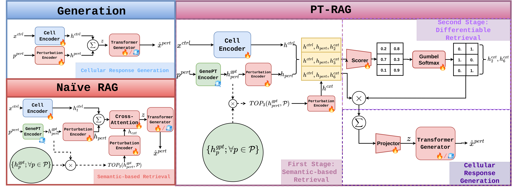

# PT-RAG: Differentiable Retrieval-Augmented Generation for Predicting Cellular Responses to Gene Perturbation

Official code for the NeurIPS 2026 paper
**"Differentiable Retrieval-Augmented Generation for Predicting Cellular Responses to Gene Perturbation"**
by Andrea Giuseppe Di Francesco\*, Andrea Rubbi\*, Rishabh Jain and Pietro Liò (\*equal contribution).

<!-- TODO: add links once available -->
[Paper (OpenReview)](TODO) · [arXiv](TODO)

<p align="center">
  
</p>

**PT-RAG** (**P**erturbation-aware **T**wo-stage **R**etrieval-**A**ugmented **G**eneration) is a plug-in
retrieval module for generative models of single-cell perturbation response.

1. **Stage 1 (semantic retrieval).** For a query perturbation, retrieve the top-`K` most similar
   perturbations by cosine similarity between [GenePT](https://github.com/yiqunchen/GenePT) gene embeddings.
2. **Stage 2 (differentiable selection).** For each candidate, a small scorer looks at the control-cell
   representation, the query perturbation and the candidate, and takes an independent include/exclude
   decision with a Straight-Through Gumbel-Softmax. The selected contexts condition the generator, and the
   selection is trained end to end with it.

PT-RAG retrieves text-derived gene embeddings, **not** measured expression responses of other perturbations.

## What is in the paper

- Fixed, non-learned retrieval (Naïve RAG) **hurts** perturbation-response prediction; retrieval with a
  learned, cell-state-aware selection step does not.
- PT-RAG is evaluated on two backbones: a **STATE-style generator used as a frozen random reservoir**, and a
  **fully trained scGPT**.
- Two settings on Replogle-Nadig: **cross-cell-type** (one cell line partially held out) and
  **cross-perturbation** (60% of perturbations held out for testing), plus a cross-perturbation experiment
  on Norman et al. (2019), a CRISPRa dataset.

> **Note on the STATE-based experiments.** In all STATE-based experiments of the paper, the transformer
> generator and its output projection are randomly initialised and kept frozen
> (`model.kwargs.freeze_pert_backbone=true`); only the encoders, the retrieval module and the readout are
> trained. These models are therefore not a reproduction of the published STATE model. The paper does not
> claim that the reported gains carry over to a fully trained generator.

## Main results

Significance vs. PT-RAG (Mann-Whitney U, Benjamini-Hochberg): † p < 0.01, †† p < 0.05, ††† p < 0.1.

**Cross-cell-type, STATE-style reservoir backbone** (1,635 test perturbations, four cell lines)

| Metric | STATE | STATE+GenePT | Naïve RAG | PT-RAG |
|---|---|---|---|---|
| Pearson DEG ↑ | 0.624 † | 0.631 | 0.396 † | **0.633** |
| Spearman DEG ↑ | 0.403 † | 0.411 | 0.307 † | **0.412** |
| MSE_PCA50 ↓ | 8.43 | 8.42 | 12.64 † | **8.39** |
| W1 ↓ | 35.70 † | 35.53 ††† | 48.48 † | **35.41** |
| W2 ↓ | 646.1 † | 638.7 †† | 1189.5 † | **633.7** |
| Energy ↓ | 9.41 ††† | 9.40 | 14.18 † | **9.33** |

**Cross-cell-type, scGPT backbone** (fully trained)

| Metric | scGPT | scGPT+GenePT | scGPT+PT-RAG |
|---|---|---|---|
| Pearson DEG ↑ | **0.9209** | 0.9167 | 0.9128 |
| Spearman DEG ↑ | 0.9500 † | **0.9509** † | 0.9368 |
| MSE_PCA50 ↓ | 18.644 † | 19.891 † | **17.321** |
| W1 ↓ | 33.799 † | 34.675 † | **32.783** |
| W2 ↓ | 578.62 † | 609.73 † | **544.70** |
| Energy ↓ | 23.534 † | 24.392 † | **22.341** |

**Cross-perturbation, STATE-style reservoir backbone** (three folds)

| Metric | STATE+GenePT | PT-RAG |
|---|---|---|
| Pearson DEG ↑ | **0.6377** | 0.6314 |
| Spearman DEG ↑ | **0.4293** | 0.4224 |
| MSE_PCA50 ↓ | 1.1477 † | **1.1316** |
| W1 ↓ | 0.8043 † | **0.8016** |
| W2 ↓ | 0.6436 † | **0.6367** |
| Energy ↓ | 0.3385 † | **0.3357** |

**Cross-perturbation on Norman et al. (2019), CRISPRa, STATE-style reservoir backbone** (63 test perturbations, one fold)

| Metric | STATE+GenePT | PT-RAG |
|---|---|---|
| Pearson DEG ↑ | 0.2985 † | **0.3856** |
| Spearman DEG ↑ | 0.2760 † | **0.3564** |
| MSE_PCA50 ↓ | 5.4482 | **5.2871** |
| W1 ↓ | 1.3706 † | **1.3339** |
| W2 ↓ | 3.0658 †† | **2.9649** |
| Energy ↓ | 0.7985 †† | **0.7815** |

The gains over the GenePT-based baselines are modest and mostly on distributional metrics; on scGPT and in the
Replogle-Nadig cross-perturbation setting they come with slightly lower DEG correlations. See the paper for the
additional controls and the limitations.

## Installation

```bash
git clone https://github.com/difra100/PT-RAG_NIPS.git && cd PT-RAG_NIPS

conda create -n ptrag python=3.11 -y
conda activate ptrag

pip install torch==2.4.0 --index-url https://download.pytorch.org/whl/cu124
pip install -r requirements.txt
pip install -e . --no-deps
```

`requirements.txt` lists the exact versions used for the experiments in the paper (Python 3.11, CUDA 12.4).
The experiments were run on NVIDIA A100 (80 GB) GPUs.

## Data

Run these from the repository root. All paths in the split files and configs are relative to the repository
root, so nothing has to be edited after the downloads.

```bash
# Replogle-Nadig Perturb-seq data (about 22 GB) -> datasets/Replogle_Nadig_dataset/
bash datasets/get_repogle_nadig.sh

# GenePT gene embeddings -> genept_emb/genept_emb/
bash genept_emb/get_genept_emb.sh

# scGPT checkpoint and vocabulary -> datasets/scgpt/   (only for the scGPT experiments; needs `pip install gdown`)
bash datasets/get_scgpt_files.sh

# Norman et al. (2019) -> datasets/Norman_dataset/     (only for the Norman experiment; needs `pip install pertpy`)
python datasets/prepare_norman.py
```

`prepare_norman.py` needs the Replogle-Nadig data, because it aligns the Norman genes to the same gene set.

The split files are in `datasets/`:

| File | Setting |
|---|---|
| `repogle_nadig.toml`, `repogle_nadig_{k562,jurkat,rpe1}.toml` | cross-cell-type, one file per held-out cell line (`repogle_nadig.toml` holds out HepG2) |
| `replogle_nadig_all_pertsplit_30_10_60_fold{0,1,2}.toml` | cross-perturbation, three folds (670 train / 133 validation / 1,206 test perturbations) |
| `norman_pertsplit_30_10_60_fold{0,1,2}.toml` | Norman cross-perturbation (32 train / 10 validation / 63 test perturbations); the paper uses fold 0 |

The Norman split files were generated with `datasets/create_norman_splits.py`.

## Reproducing the experiments

Each script trains the models of one experiment and then evaluates them.

| Script | Experiment | Methods | PT-RAG settings |
|---|---|---|---|
| `scripts/run_crosscelltype_state.sh [cells]` | cross-cell-type, STATE-style backbone | STATE, STATE+GenePT, Naïve RAG, PT-RAG | K = 32, λ = 0.1 |
| `scripts/run_crosscelltype_scgpt.sh [cells]` | cross-cell-type, scGPT backbone | scGPT, scGPT+GenePT, scGPT+PT-RAG | K = 128, λ = 1.0 |
| `scripts/run_crossperturbation_state.sh [folds]` | cross-perturbation, Replogle-Nadig | STATE+GenePT, PT-RAG | K = 128, λ = 1.0 |
| `scripts/run_norman.sh [fold]` | cross-perturbation, Norman | STATE+GenePT, PT-RAG | K = 16, λ = 1.0 |
| `scripts/run_controls.sh [fold]` | additional controls (see below) | STATE+GenePT, PT-RAG | K = 32, λ = 1.0 |

K is the number of retrieved candidates (`training.topk_rag`) and λ the weight of the sparsity loss
(`training.gumbel_sparsity_weight`). The Gumbel-Softmax temperature is 0.5 in all experiments.

```bash
CUDA_VISIBLE_DEVICES=0 bash scripts/run_crosscelltype_state.sh           # all four cell lines
CUDA_VISIBLE_DEVICES=0 bash scripts/run_crosscelltype_state.sh jurkat    # one cell line
CUDA_VISIBLE_DEVICES=0 bash scripts/run_crossperturbation_state.sh 0 1 2
```

Optional environment variables (see `scripts/common.sh`):

| Variable | Meaning | Default |
|---|---|---|
| `EXP_DIR` | where the runs are written | `./experiments` |
| `USE_WANDB` | log to Weights & Biases (set your entity in `src/state/configs/wandb/default.yaml`) | `false` |
| `NUM_WORKERS` | data-loading workers | `4` |

A run that already has a final checkpoint is skipped, so a script can be restarted.

## Training a single model

All commands are run from the repository root.

**PT-RAG, cross-cell-type (STATE-style reservoir backbone), Jurkat held out**

```bash
export PYTHONPATH=$PWD/src:$PYTHONPATH
python -m state.__main__ tx train \
    data.kwargs.toml_config_path=$PWD/datasets/repogle_nadig_jurkat.toml \
    data.kwargs.embed_key=X_hvg data.kwargs.output_space=gene \
    data.kwargs.batch_col=gem_group data.kwargs.pert_col=gene \
    data.kwargs.cell_type_key=cell_line data.kwargs.control_pert=non-targeting \
    training.max_steps=50001 training.val_freq=2000 training.batch_size=64 training.lr=1e-3 \
    model=state model.kwargs.cell_set_len=64 model.kwargs.hidden_dim=128 \
    model.kwargs.batch_encoder=true model.kwargs.freeze_pert_backbone=true \
    training.use_genept=true training.rag=true training.differentiable_rag=true \
    training.retrieve_than_predict=true training.gumbel_sparsity_loss=true \
    training.topk_rag=32 training.gumbel_sparsity_weight=0.1 \
    output_dir=$PWD/experiments/crosscelltype_state name=jurkat_ptrag use_wandb=false
```

**Baselines.** Replace the three `training.*` lines after `model.kwargs.batch_encoder` with:

| Method | Flags |
|---|---|
| STATE (one-hot) | `training.use_genept=false training.rag=false` |
| STATE+GenePT | `training.use_genept=true training.rag=false` |
| Naïve RAG | `training.use_genept=true training.rag=true training.differentiable_rag=false training.retrieve_than_predict=true training.topk_rag=32` |

**Cross-perturbation.** Use a fold file and restrict the retrieval pool to the perturbations seen in training:

```bash
    data.kwargs.toml_config_path=$PWD/datasets/replogle_nadig_all_pertsplit_30_10_60_fold0.toml \
    training.split_aware_rag=true training.topk_rag=128 training.gumbel_sparsity_weight=1.0 \
```

With `training.split_aware_rag=true` the model retrieves only from training perturbations during training;
at test time the pool is the full perturbation vocabulary unless `--retrieval-pool` says otherwise. Only the
GenePT embeddings of the retrieved genes are used, never their measured expression.

**scGPT backbone.** Use `model=scgpt-genetic` (scGPT) or `model=scgpt-genetic-rag` (scGPT+GenePT, scGPT+PT-RAG)
with `training.lr=5e-5 training.max_steps=25001`; see `scripts/run_crosscelltype_scgpt.sh`.

## Evaluation

```bash
python -m state.__main__ tx predict \
    --output-dir experiments/crosscelltype_state/jurkat_ptrag \
    --checkpoint last.ckpt \
    --eval-genept-pert
```

This writes the predictions and a `results.csv` with one row per test perturbation (Pearson and Spearman
correlation on differentially expressed genes; MSE, Wasserstein-1, Wasserstein-2 and Energy distance in a
50-dimensional PCA space) inside the run directory.

## Additional controls

`scripts/run_controls.sh` runs the controls of the paper's appendix in the cross-perturbation setting
(one fold, K = 32). They use these options:

| Control | Option |
|---|---|
| Retrieval pool at test time: all perturbations, train + validation, or train only | `tx predict ... --retrieval-pool {full,trainval,train}` |
| Replace a fraction of the retrieved candidates with the least similar perturbations (hard negatives) | `tx predict ... --hard-negative-fraction 0.6` |
| Freeze the perturbation encoder, so that only the selector and the projector are trained on the retrieval side | `tx train ... model.kwargs.freeze_pert_encoder=true training.init_pert_encoder_from=<STATE+GenePT checkpoint>` |

Each evaluation variant writes its results to its own folder inside the run directory.

## Repository structure

```
datasets/              split files, download and preparation scripts
genept_emb/            GenePT download script
scripts/               one script per experiment of the paper (common.sh holds the shared settings)
jaccard_experiments/   analysis of cell-type-specific retrieval
src/state/tx/models/state_transition.py    STATE-style model with Naïve RAG and PT-RAG
src/state/tx/models/scgpt/rag_model.py     scGPT with GenePT and PT-RAG
src/state/_cli/_tx/                        training and prediction entry points
```

## Citation

```bibtex
@inproceedings{difrancesco2026ptrag,
  title     = {Differentiable Retrieval-Augmented Generation for Predicting Cellular Responses to Gene Perturbation},
  author    = {Di Francesco, Andrea Giuseppe and Rubbi, Andrea and Jain, Rishabh and Li{\`o}, Pietro},
  booktitle = {Advances in Neural Information Processing Systems (NeurIPS)},
  year      = {2026}
}
```

## Acknowledgements and license

This code builds on [STATE](https://github.com/ArcInstitute/state) by the Arc Institute, and on
[scGPT](https://github.com/bowang-lab/scGPT), [GenePT](https://github.com/yiqunchen/GenePT),
[cell-load](https://github.com/ArcInstitute/cell-load) and
[gge-eval](https://pypi.org/project/gge-eval/). We thank their authors.

The code is released under the same license as STATE, Creative Commons
Attribution-NonCommercial-ShareAlike 4.0 (see `LICENSE`).
